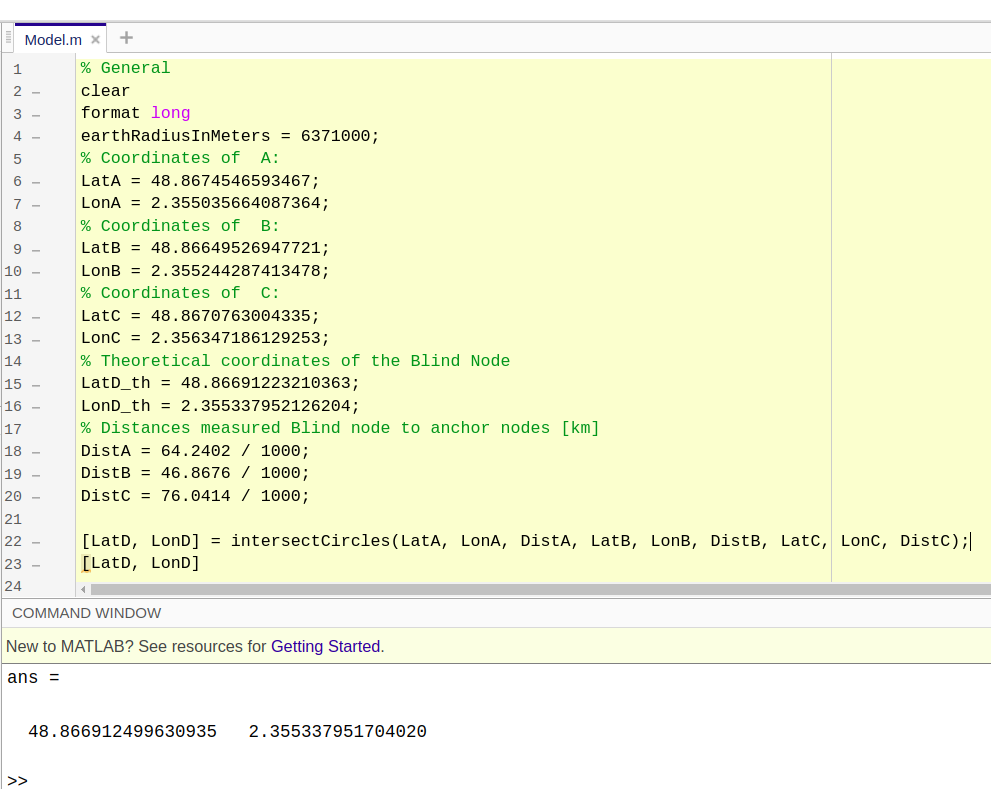

The following image is a snapshot of the results received while the mathematical model is implemented in the form of MATLAB code
The input values given are the coordinates to three anchor nodes and their respective distances from the blind node.\
The output received is the coordinates of the blind node.

The results are : The theorotical coordinates of the blind node (48.8670763004335 , 2.356347186129253)\
                    The estimated coordinates of the blind node (48.8669124996309 , 2.355337951704020)
